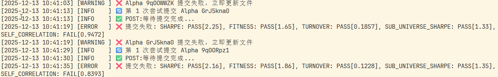

# WorldQuant Brain Alpha 自动提交系统


## 项目简介

紧接入门四课程后从模板中批量生成的alpha，能自动筛选合格的Alpha并按数量提交

> 告别从成千上万次回测中在平台上一个个挑选并检测SC因子的烦恼！

## 功能特性

- ✅ 自动认证登录 WorldQuant Brain API
- 🔍 从模拟结果中智能筛选6项指标全部PASS的Alpha
- 📊 严格检查6项核心指标：
  - LOW_SHARPE（夏普率）
  - LOW_FITNESS（适应度）
  - LOW_TURNOVER（低换手率）
  - HIGH_TURNOVER（高换手率）
  - CONCENTRATED_WEIGHT（权重集中度）
  - LOW_SUB_UNIVERSE_SHARPE（子宇宙夏普率）
- 🚀 根据设定值批量提交Alpha，自动处理重试机制，提交时自动检测SC因子
- 💾 自动维护未提交Alpha列表，方便下次继续提交
- 📝 完善的日志系统：
  - 控制台输出：INFO及以上级别（关键操作信息）
  - 文件记录：DEBUG及以上级别（详细调试信息）
  - 日志文件按日期自动分割：`logs/alpha_commit_YYYYMMDD.log`
- 🛡️ 程序中断保护：实时更新alpha_ids.txt，防止进度丢失


## 项目结构

```
worldquant-autocommit-alpha/
├── alpha_commit.py              # 主程序，核心功能都在这里
├── brain_credentials_copy.txt   # 账号密码配置文件（别tm传GitHub！）
├── logs/                        # 日志目录（自动生成）
│   └── alpha_commit_YYYYMMDD.log  # 按日期分割的日志文件
├── alpha_ids.txt                # 待提交的Alpha ID列表
├── simulated_alphas_*.csv       # 批量回测生成的CSV文件
└── README.md                    # 说明文件
```

## 安装步骤

### 1. 安装依赖

```bash
pip install requests pandas
```


### 2. 配置账号密码

编辑 `brain_credentials_copy.txt` 文件：

```json
["你的邮箱@example.com", "你的密码"]
```

> ⚠️ **警告**：别tm把这个文件上传到GitHub，不然你的账号被人盗或者被封了别找我哭！

### 3. 准备模拟结果数据

需要准备CSV文件（默认是 `test.csv`），格式要求：
直接使用新手第四课批量回测生成的simulated_alphas_YY-MM-DD.csv文件即可

CSV文件可以是**有表头**或**无表头**的，程序会自动识别。

## 使用方法

### 方式一：提取合格Alpha并保存

```bash
python alpha_commit.py
```

选择选项 `1`，程序会从CSV中提取符合6项指标全部PASS的Alpha，保存到 `alpha_ids.txt`。

### 方式二：提交已保存的Alpha

```bash
python alpha_commit.py
```

选择选项 `2`，程序会从 `alpha_ids.txt` 中读取Alpha ID并批量提交。

**提示**：你需要输入要提交的数量，比如输入 `5` 表示提交5个Alpha。

### 方式三：提取并提交（一步到位）

```bash
python alpha_commit.py
```

选择选项 `3`，程序会先提取合格Alpha，然后立即提交。

## 工作流程

```
┌─────────────────────────────────────────────────────────────┐
│                     WorldQuant Brain                        │
│                    模拟结果CSV文件                          │
└────────────────────────┬────────────────────────────────────┘
                         │
                         ▼
┌─────────────────────────────────────────────────────────────┐
│              1. 提取 qualified Alpha IDs                    │
│              (检查6项指标是否全部PASS)                      │
└────────────────────────┬────────────────────────────────────┘
                         │
                         ▼
┌─────────────────────────────────────────────────────────────┐
│              2. 保存到 alpha_ids.txt                        │
└────────────────────────┬────────────────────────────────────┘
                         │
                         ▼
┌─────────────────────────────────────────────────────────────┐
│              3. 批量提交Alpha                               │
│              • 自动重试(最多5次)                            │
│              • 检查提交状态                                 │
│                                         │
└────────────────────────┬────────────────────────────────────┘
                         │
                         ▼
┌─────────────────────────────────────────────────────────────┐
│              4. 更新alpha_ids.txt                           │
│              (删除已成功提交和SC因子不合格的)                             │
└─────────────────────────────────────────────────────────────┘
```


## 常见问题

### 1. 认证失败

**问题**：`❌ 认证错误: 认证失败: HTTP 401`

**解决**：
- 检查 `brain_credentials_copy.txt` 格式是否正确（JSON数组格式）
- 确认邮箱和密码无误
- 检查网络连接是否正常

### 2. 提交被拒绝

**问题**：`❌ 提交被拒绝 (400/403)`

**解决**：
- Alpha ID可能已提交过
- Alpha可能不符合提交条件（检查模拟结果）

### 3. API限流

**问题**：提交速度太慢或频繁失败

**解决**：
- 程序已内置10秒间隔，别tm乱改！
- 如果还是限流，增加间隔时间到15-20秒

### 4. 找不到CSV文件

**问题**：`错误：找不到文件 test.csv`

**解决**：
- 将CSV文件放在脚本同目录下
- 修改脚本中的 CSV文件名 和 路径

## 版本历史

### v0.2.0 (2025-12-13) 🎉

#### 🔥 核心功能增强

**1. 失败Alpha详细诊断显示**
- ❌ **旧版**：提交失败时仅显示HTTP状态码（如400、403），无法知道具体失败原因
- ✅ **新版**：显示所有6项核心指标的实际检查结果，精准定位失败原因
  ```
  示例输出：
  ❌ 提交失败:
     SHARPE: PASS[True],
     FITNESS: PASS[True],
     TURNOVER: PASS[True],
     SUB_UNIVERSE_SHARPE: PASS[True],
     SELF_CORRELATION: FAIL[False]  ← 一眼看出问题所在！
  ```
- 💡 **优势**：帮助快速诊断Alpha质量问题，优化策略调整方向

**2. 完善的日志系统** 📝
- ✅ 双通道日志输出：
  - **控制台**：显示INFO及以上级别，简洁清晰的关键信息
  - **日志文件**：记录DEBUG及以上级别，包含完整的调试信息
- ✅ 智能日志管理：
  - 日志文件按日期自动分割：`logs/alpha_commit_20251213.log`
  - 统一时间戳格式：`[2025-12-13 14:30:15] [INFO] 消息内容`
  - 自动创建logs目录，处理文件权限错误
- ✅ 详细记录每次操作：
  - 认证过程（成功/失败）
  - 每个Alpha的提交尝试和结果
  - 文件更新操作
  - 异常和错误信息
- 💡 **优势**：方便追溯历史运行记录，调试问题，统计成功率

**3. 程序中断保护机制** 🛡️
- ❌ **旧版问题**：
  - 批量提交过程中按Ctrl+C或程序异常崩溃
  - 已处理的Alpha ID不会从alpha_ids.txt中移除
  - 下次运行时会重复提交相同的Alpha
  - 可能导致API限流或账号异常
- ✅ **新版解决方案**：
  - **实时文件更新**：每次提交完成（无论成功或失败）立即从文件中移除该ID
  - **优雅中断处理**：捕获Ctrl+C信号，显示当前进度统计
  - **异常保护机制**：文件更新操作有完整的try-except保护
  - **进度提示**：中断时显示"已成功X个，失败Y个，剩余Z个待处理"
- 💡 **优势**：
  - ✅ 断点续传：下次运行从中断处继续，不重复提交
  - ✅ 数据安全：进度实时保存，永不丢失
  - ✅ 灵活控制：可随时中断，不影响已完成的工作

---

### v0.1.0 (2025-12-10) - 初始版本

- ✅ 认证登录
- ✅ Alpha筛选
- ✅ 批量提交
- ✅ 自动重试

## 跪求星标 🤩

**⭐ 如果这个工具帮你省了时间、救了命，麻烦您给点个Star！**

---

**开发者：tomography2308@163.com**


